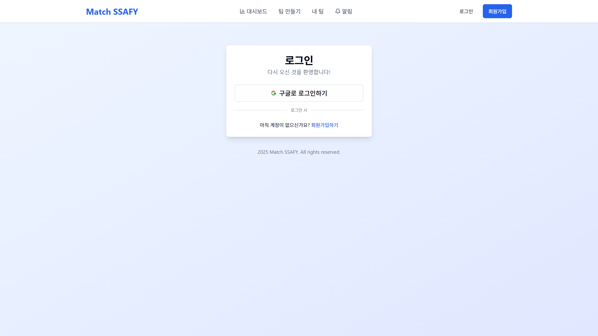
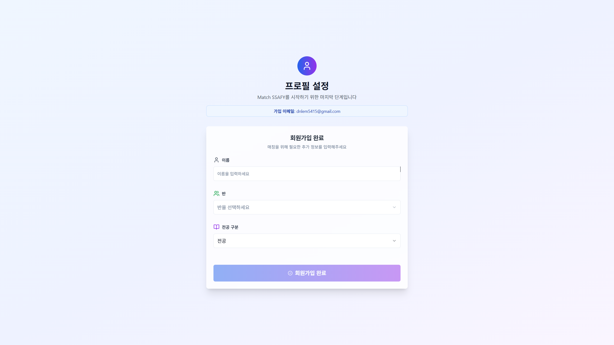
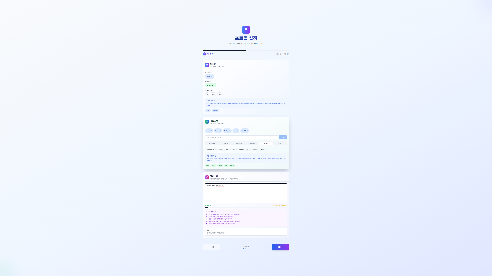
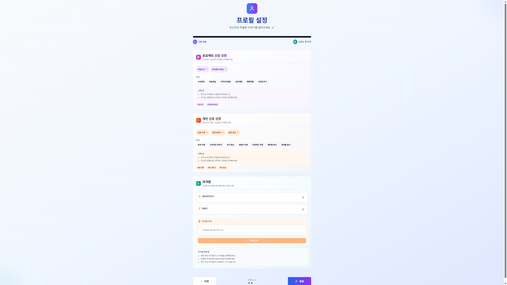
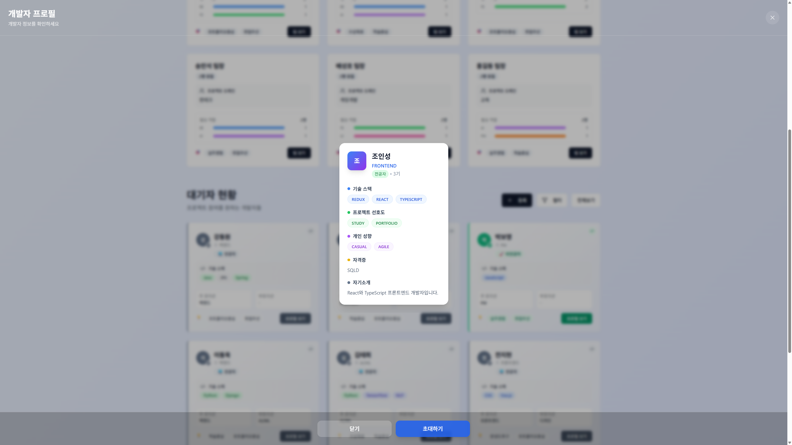
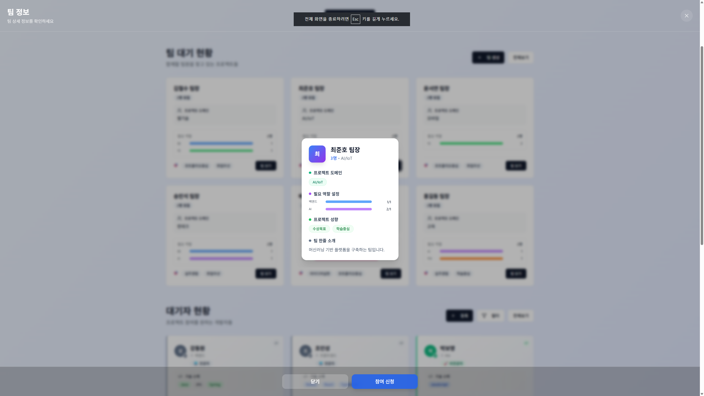
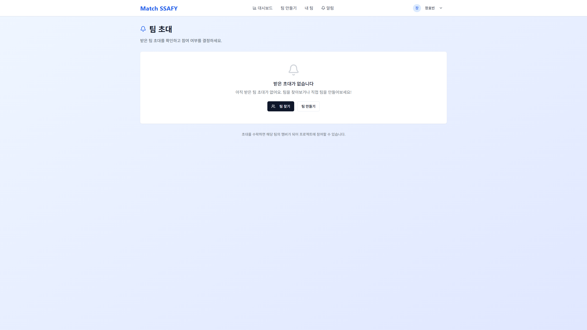

## 프로젝트 개요
https://youtu.be/9Fvnp_ME37k

**목적**: 부트캠프 내부에서의 프로젝트 팀빌딩을 구조화하여 교육생과 관리자의 편의성을 높인다

**업무 공유 방법**: Jira를 이용해 티켓을 발행하고 업무 진행, Notion과 Swagger을 이용해 API와 컨벤션을 공유

## 기술 스택

Java 17, Spring Boot 3, React, JPA, Spring Security, Postgres, Docker, AWS, Nginx, Jenkins, Gitlab, Jira

## 아키텍처

## 주요 기능

### 1. 데이터 기반 매칭 추천 시스템

- 교육생의 성향(MBTI 등)과 기술 스택 데이터를 종합적으로 분석하여 최적의 팀을 추천
- 단순 랜덤 배정이 아닌, 데이터에 기반한 과학적인 매칭으로 팀의 시너지를 극대화

### 2. 맞춤형 멤버 추천 및 등록 제안

- 개인에게 팀 추천 뿐이 아닌, 팀을 대상으로 멤버 추천도 추가. 현재 후보군과 팀 상황을 기반으로 추천
- 추천받은 멤버에게 팀 등록 제안 가능

### 3. 한 눈에 확인 가능한 통계 정보

- 프로님들이 현재 교육생들의 매칭 현황을 한 눈에 확인할 수 있는 대쉬보드 기능 제공
- 포지션 별, 도메인 별, 전공 여부 기준으로 분류된 데이터로 인사이트를 제공

### 4. SSAFY 교육생을 위한 편의 기능

- 교육생이 직접 자신의 프로필(기술 스택, 희망 역할 등)을 관리하고 원하는 팀을 탐색할 수 있는 기능을 제공

### 5. 팀 페이지 기능

- 팀원들과 채팅 기능 및 AI로 추천받은 대기자 초대 기능 제공

## 스크린샷

### 메인 화면

### 로그인 화면

### 대시보드 화면

### 회원가입 화면

### 팀 생성 화면

### 팀 페이지 화면

### AI 추천 화면

### 대기자 등록 화면

### 대기자 상세보기 모달

### 팀 상세보기 모달

### 알림 화면

## 기여도와 역할

**이도준**: 팀장, 백엔드 및 인프라

- 인프라 및 백엔드 개발 담당

**장효빈**: 팀원, 풀스택

- 소셜 로그인, 백엔드 유저 도메인 개발, 프론트엔드 API 매핑

**이승주**: 팀원, 백엔드

- 백엔드 팀, 채팅 도메인 개발, 웹소켓으로 실시간 채팅 구현

**봉현진**: 팀원, 프론트엔드

- 디자인, 화면 개발

**문종원**: 팀원, PM 및 AI

- 발표 및 추천 AI 개발

**이상경**: 팀원, 프론트엔드

- 발표자료 작성 및 화면 개발

## 배운 점

생각보다 Git에서 문제가 많이 발생했다. 잘못된 사용으로 인해 코드가 유실되는 사고가 몇 차례 일어나 개발시간을 낭비했다. 다음 프로젝트에서는 Approve를 적극적으로 사용해야겠다. 또한 백엔드 개발자일지라도 인프라에 대해 이해가 필요함을 느꼈다.
